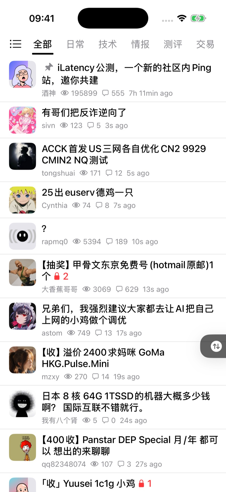
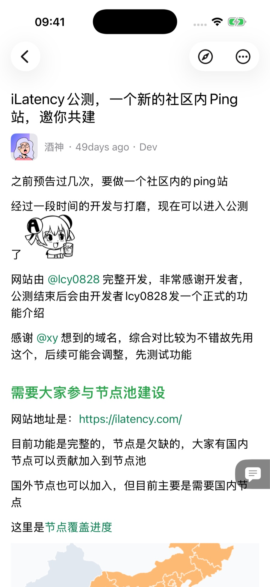
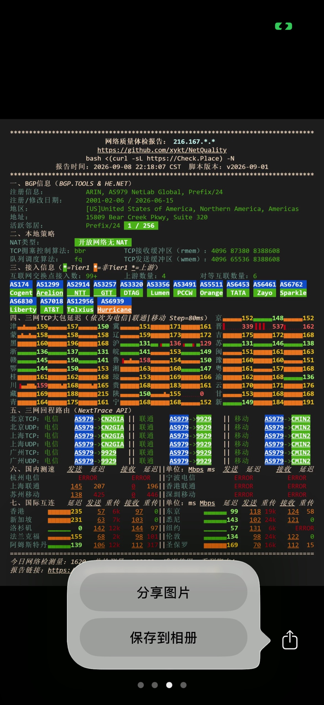
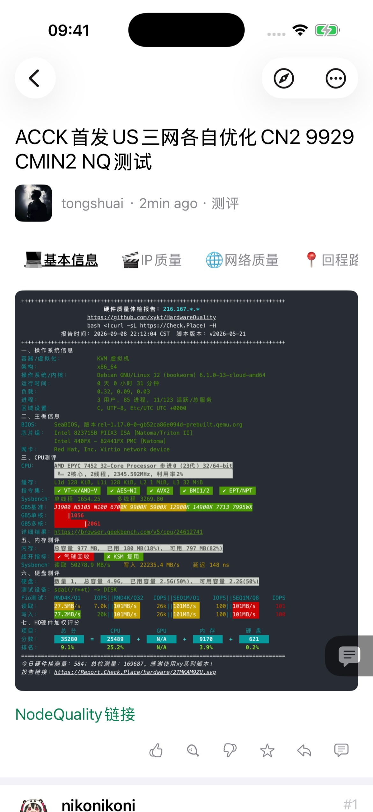
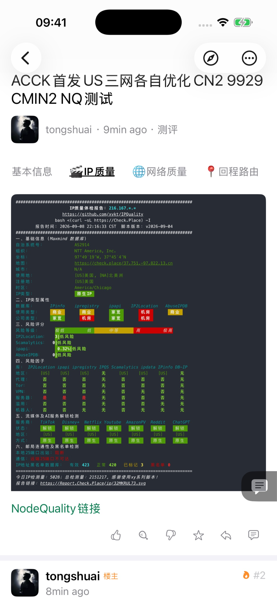
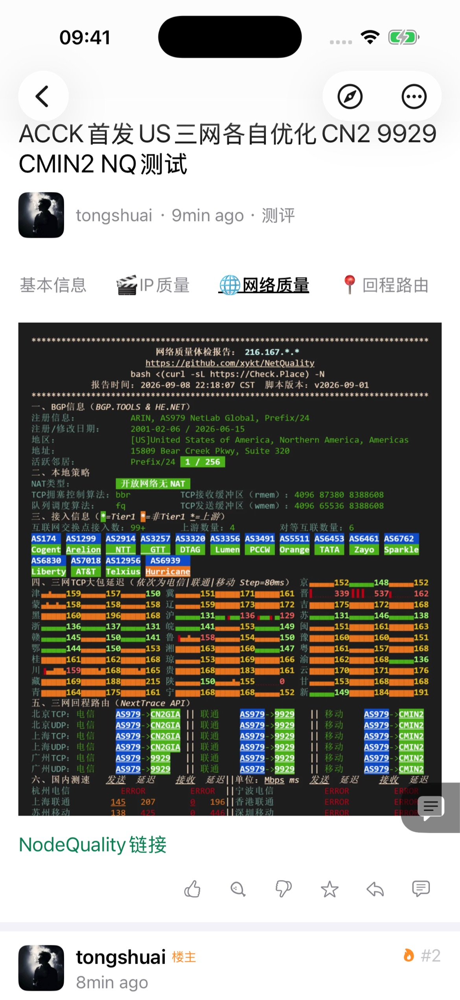
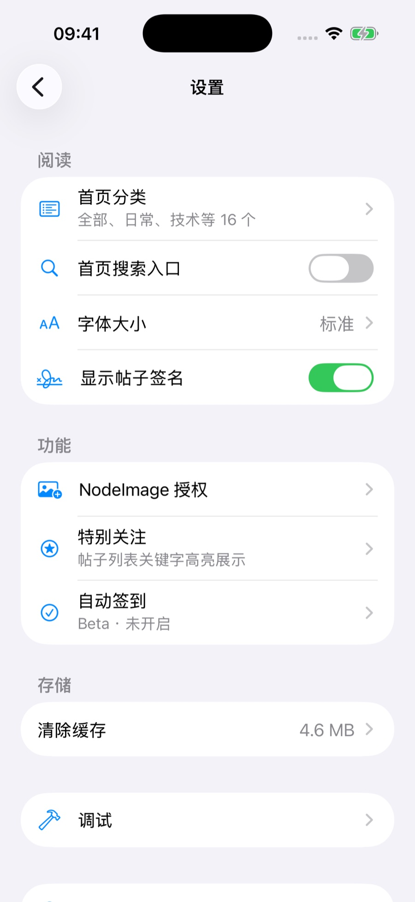
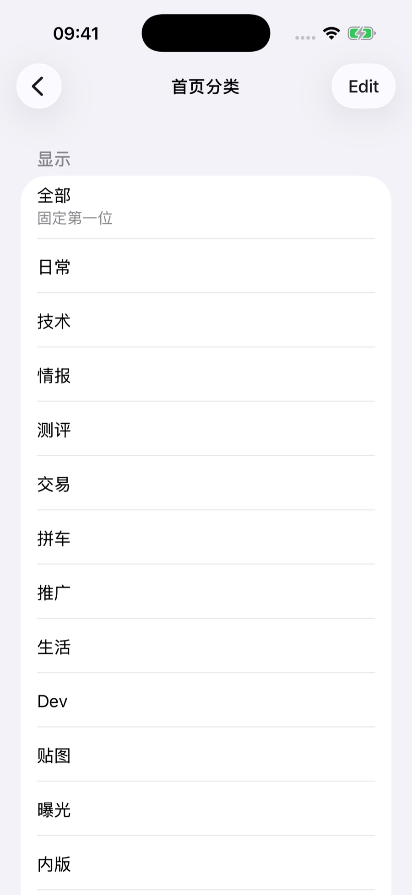
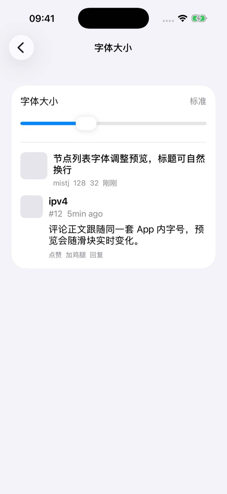

# NS Connect · NodeSeek iOS

NS Connect 是一个开源、非官方的 NodeSeek iOS 客户端，基于 Texture 的异步布局与渲染能力，打造高性能的原生列表与帖子阅读体验。支持浏览、搜索、回复、收藏、投票和图片上传，并适配系统浅色与深色模式。现已上架 App Store。

通过 **GitHub Actions + fastlane 自动构建并上传 TestFlight**，在 App 内即可查看当前版本的 **Git hash 和构建记录**，方便核对源码、定位问题。

## 安装体验

**[从 App Store 下载](https://apps.apple.com/cn/app/ns-connect/id6766863710)**
**[加入 TestFlight 测试](https://testflight.apple.com/join/T2YSXzFs)**

> 接入通知能力，自行部署 https://github.com/tyrad/ns-apns

## 支持的功能

### 浏览与搜索

- **帖子列表**：分类浏览、下拉刷新、分页加载，按发帖时间或回复时间排序。
- **分类管理**：调整首页分类的显示、隐藏和顺序。
- **站内搜索**：按关键词和分类搜索，保留最近搜索记录。
- **最近浏览**：查看本机浏览过的帖子，方便返回继续阅读。
- **特别关注**：按关键词标记首页帖子标题和发帖人，支持自定义标记颜色及关键词导入、导出。

### 阅读与互动

- **帖子详情**：原生展示正文、评论、富文本和图片，支持表格、终端内容及 Magic Tabs 等特殊内容展示。
- **回复与引用**：回复帖子或评论、组合多条回复与引用，插入 NodeSeek 表情。
- **站内互动**：收藏或取消收藏帖子，为帖子和评论点赞、投放鸡腿或反对。
- **投票**：查看帖子投票、提交选项及查看结果，具体权限以站点规则为准。
- **个人内容**：查看自己的主题、评论和收藏；用户资料通过站内网页打开。
- **通知**：查看站内通知、未读数量及标记已读。
- **发帖**：在 App 内打开 NodeSeek 发帖网页。

### 图片与阅读设置

- **图片浏览**：预览、缩放、保存和分享图片，支持 GIF、SVG 等图片内容。
- **NodeImage 上传**：授权后选择图片或拍照上传，将图片插入回复；可在设置中单独取消授权。
- **阅读偏好**：调整字体大小、签名显示和首页搜索入口，支持系统浅色与深色模式。
- **缓存管理**：查看图片缓存占用，清除图片、网页及网络缓存并保留登录状态。
- **自动签到**：默认关闭，开启后会在打开开关、回到前台、返回首页、或加载首页任一分类第一页时尝试签到，可选择“鸡腿 x 5”或“试试手气”。当天成功后不再重复；撞上站点验证会冷却后再试。

部分功能需要登录并具备相应站点权限；遇到站点验证或暂不支持的内容时，可通过网页继续操作。

## 隐私与安全

- **网页登录**：通过 NodeSeek 网页登录，使用你自己的账号授权。
- **本机保存**：登录状态、浏览记录、搜索历史和偏好保存在本机；NodeImage 授权密钥使用系统 Keychain 保存。
- **授权可清除**：可单独取消 NodeImage 授权；退出登录会清除 NodeSeek 登录状态及本机 NodeImage 授权。
- **日志默认关闭**：需要排查问题时可手动开启，也可随时查看和删除。

更多说明见[隐私政策](docs/privacy.md)。

## 自动打包与版本追溯

使用 **GitHub Actions + fastlane** 自动打包并上传 TestFlight，构建过程可在公开仓库中查看。

打开 **侧边栏 → 设置 → 关于**，即可查看版本号、Build 和 **Git hash**，并通过 **Workflow** 进入对应构建记录，方便核对源码版本和反馈问题。本地构建未写入这些信息时，会显示“未注入”或“本地构建”。

## 本地开发

使用 Xcode 打开 `nodeseek.xcodeproj` 即可开始。环境要求、项目结构与测试命令见[开发文档](docs/project-overview.md)，自动打包配置见[发布文档](docs/testflight-release.md)。

## 截图

| 首页浏览                                                                                                    | 图文详情                                                                                                                  | 图片预览与分享                                                                                                                      |
| ----------------------------------------------------------------------------------------------------------- | ------------------------------------------------------------------------------------------------------------------------- | ----------------------------------------------------------------------------------------------------------------------------------- |
|  |  |  |

| NQ 基本信息                                                                                                              | NQ IP 质量                                                                                                      | NQ 网络质量                                                                                                                |
| ------------------------------------------------------------------------------------------------------------------------ | --------------------------------------------------------------------------------------------------------------- | -------------------------------------------------------------------------------------------------------------------------- |
|  |  |  |

| 阅读与功能设置                                                                                                            | 首页分类管理                                                                                                                | 字体大小与预览                                                                                                              |
| ------------------------------------------------------------------------------------------------------------------------- | --------------------------------------------------------------------------------------------------------------------------- | --------------------------------------------------------------------------------------------------------------------------- |
|  |  |  |

## 许可证

本项目使用 [MIT License](LICENSE)。
